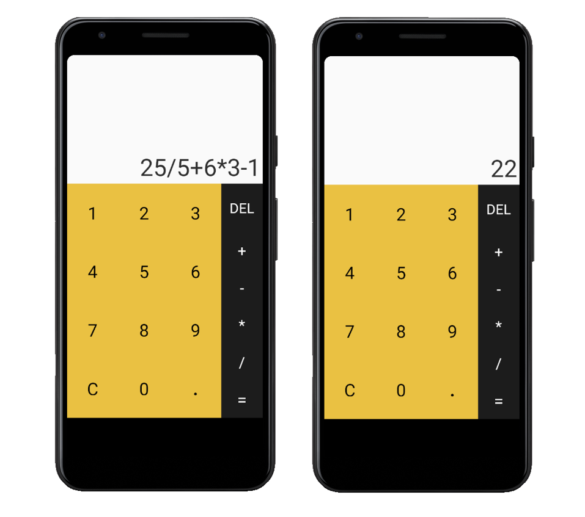

Basic Calculator Android application capable of handling simple mathematical expressions using the principle of BODMAS. This was developed as part of the MOOC - 'Android Programming for Beginners' on Udacity.

 

